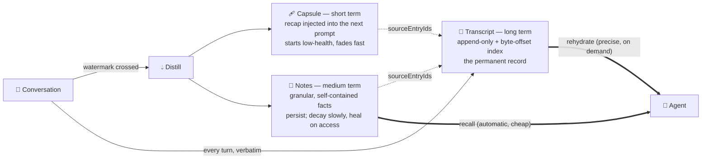
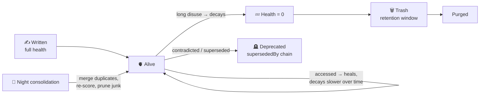
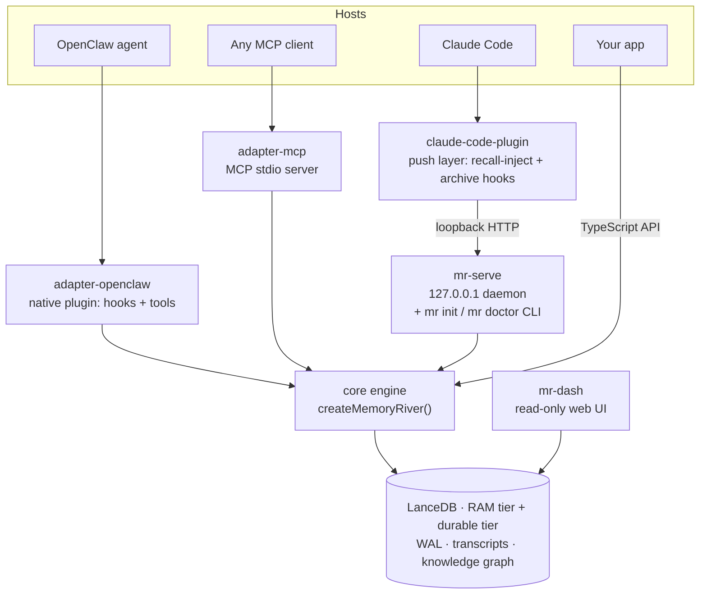

<div align="center">


<br>
<br>

**_Long-term memory for AI agents — a working recap that fades, facts that persist, and the full transcript it can always go back and re-read._**

<br>

[](LICENSE)
[](https://www.typescriptlang.org/)
[](https://nodejs.org/)
[](https://lancedb.com/)
[](https://ollama.com/)

<br>

[繁體中文](./README.zh-TW.md) · [core package docs](packages/core/README.md)

<br>

*Most "agent memory" is a vector store with a save button — one flat pile of embeddings you write to and search.*<br>
*Memory River treats memory as a **system**: it keeps information at **three timescales**, retrieves it in **two passes**,*<br>
*lets memories **metabolize** over time — and anything it distills can be **traced back to the exact turns it came from**.*

</div>

---

## ✨ Why Memory River

Most AI memory systems are designed like a **database** — write rows, query rows. Memory River is designed like **memory itself**:

| Ordinary "vector memory" | Memory River |
|:---|:---|
| One flat pile of embeddings, write-once | **Three timescales**: a recap that fades, notes that persist, transcript that's permanent |
| Compaction = truncate the old turns | Compaction = **distill** into a capsule + granular notes; raw turns archived verbatim, nothing dropped |
| Lossy is lossy — detail is gone | Lossy memories carry **pointers back to the source**; the agent can `rehydrate` exact numbers / names / dates |
| Memories never change | Memories **decay, refresh on access, and get superseded**; contradictions are flagged & deprecated, not silently kept |
| Grows dirtier forever | **Nightly consolidation** merges duplicates; dead memories leave through a trash-protected path |
| Embeddings need a cloud API | **Fully local** Ollama embeddings — zero cloud dependency, self-hostable |
| Black box: why did it return *this*? | **Auditable**: every distilled claim traces back to the turns that produced it |

> This README describes only what's in the code today — nothing aspirational.

---

## 🧠 The idea: three timescales of memory

When a conversation grows past a watermark, Memory River doesn't truncate the old turns — it **distills** them into three layers:



- **Short term — the session capsule.** A compact recap of what just happened, injected at the top of the next prompt. It starts at low health and **metabolizes fast** — this is working memory for *this* session, not a fact store. The capsule is domain-adaptive: a coding session gets a structured task summary; a casual chat gets a natural-language recap.
- **Medium term — distilled notes.** Alongside each capsule, a handful of granular, self-contained facts are extracted and written to the store. They start at full health and **persist** — this is what `recall` surfaces days later.
- **Long term — the raw transcript.** Every turn is archived verbatim with a byte-offset index, and the capsule records exactly which turns it summarized — **so compression never truly loses anything.**

---

## 🔍 Two-pass retrieval + gap-aware rehydrate

Vector retrieval **always loses precision**. Memory River's answer isn't to cram every detail into the vector — it's to let the agent **know its recall isn't precise enough and go back to the source on its own**:

1. **Coarse recall (automatic, cheap).** Before each turn, `assembleContext` injects the few most relevant memories. Always on.
2. **Rehydrate (precise, on demand).** A lossy memory carries pointers back to its source turns — the agent pulls the exact original turns by **entry-id / time window / keyword**.

The leverage is the agent's **judgment**: treat recall as *candidate evidence*, not the answer; decide whether it's precise enough; if not, go straight to the source via the most reliable `entry_ids`, falling back to keyword search on concrete entities only when recall comes up empty; **retrieving something ≠ success** (verify the source actually contains the answer); only say "I don't know" after escalating across strategies. This disposition is agent-agnostic and can be dropped into any host agent — see [`docs/AGENT_MEMORY_SYSTEM_PROMPT.md`](docs/AGENT_MEMORY_SYSTEM_PROMPT.md).

> The common case stays cheap (you don't reload the whole conversation every turn), precise detail is never more than one hop away, and the whole chain is **auditable**.

---

## 🧬 Memory that metabolizes

Memories aren't write-once rows — they **live**. Health follows a forgetting curve: a hit **heals** a memory, long disuse makes it **decay**, and the more often it's accessed the slower it decays:



A newer fact **supersedes** a close older one; contradictions are **flagged and deprecated**, never silently kept; a nightly pass **merges** redundant memories; dead ones leave through a trash-protected path. Core categories (identity / constraint / business / core_rule), high-importance facts, and skill capsules are **immune to decay** — so the store stays relevant instead of growing into noise.

---

## 🗺️ Architecture

One engine, many doors. The core is framework-neutral; every host talks to it through an adapter:



| Package | What it is |
|:---|:---|
| [`@memory-river/core`](packages/core/README.md) | The framework-neutral engine and `createMemoryRiver` API: stores, distillation pipeline, retrieval, transcript archive, lifecycle jobs, graph/causal logic, skills, GWM |
| `@memory-river/service` | `mr-serve`, a loopback-only HTTP daemon (`/recall`, `/store`, `/rehydrate`, `/archive-transcript`, `/health`) plus the `mr init` / `mr doctor` onboarding CLI |
| `@memory-river/claude-code-plugin` | The **push layer** for Claude Code: a hook injects relevant memories into every prompt, another archives the session transcript on exit — fail-open, zero config in the editor |
| `@memory-river/adapter-openclaw` | Native OpenClaw plugin (hooks, tools, compaction integration, session archiving) |
| `@memory-river/adapter-mcp` | MCP stdio server exposing memory, transcript, skill, and working-memory tools to any MCP host |
| `@memory-river/dashboard` | `mr-dash`, a read-only LanceDB inspector: CLI reports plus a local web UI (memories / graph / slots / effectiveness) |
| `@memory-river/example-cli` | A ~110-line Ollama-backed integration proving the core works standalone |
| `@memory-river/benchmark` | `mr-bench`: lifecycle, retrieval, CRAG, recovery, LoCoMo, and Chinese-chat evaluation harnesses — the numbers below come from here |

---

## 🚀 Quick Start

**Prerequisites:** Node 22+, and [Ollama](https://ollama.com/) running locally for embeddings (fully local — no cloud account needed):

```bash
ollama pull hf.co/Qwen/Qwen3-Embedding-0.6B-GGUF
npm ci && npm run build
```

### Path A — plug it into Claude Code (shortest way to feel it)

```bash
# 1) configure — a 3-question wizard (or --yes for all defaults), then verify the environment
npx mr init
npx mr doctor

# 2) start the daemon and keep it running
npx mr-serve

# 3) wire it into Claude Code
claude plugin marketplace add /path/to/memory-river
claude plugin install memory-river@memory-river
```

From then on every prompt you type gets relevant long-term memories injected as context, and each session's transcript is archived when it ends. The hooks are **fail-open**: if the daemon is down they silently do nothing — Claude Code never breaks.

`mr init` asks exactly three things: the embedding provider (semi-permanent — switching later means re-indexing), the distillation LLM (or `skip` for [no-key degraded mode](#%EF%B8%8F-durability--operational-honesty)), and the data directory. Config lands in `~/.memory-river/config.json` (mode `0600`). `mr doctor` then checks seven things — config, embedding reachability + dimensions, LLM key, `/dev/shm` space, service port, data dir writability, WAL state — each with a one-line fix hint.

### Path B — standalone, no host at all

```bash
ollama pull qwen3:8b   # a small local chat model for the demo

npx mr-demo remember "The deployment window is Friday at 18:00."
npx mr-demo recall "When is deployment?"
npx mr-demo chat
```

Embedded usage, the full API, dependency ports, and porting guidance are in the **[core package docs](packages/core/README.md)**.

### 🔭 See your memories: Web Dashboard

Memory shouldn't be a black box. `mr-dash serve` starts a **read-only** local web UI (bound to `127.0.0.1`, no external calls, never modifies data) so you can inspect a memory-river instance in your browser:

```bash
# keep this terminal open, then open the printed URL in a browser
node packages/dashboard/dist/cli.js serve --db /path/to/lancedb --port 7777
# → http://127.0.0.1:7777
```

Tabs cover **Tables** (row counts), **Effectiveness** (per-subsystem stats), **Night** (consolidation runs), plus **Memories / Graph / Slots** for browsing the actual contents (capsule health, knowledge-graph triples, structured slots). A 中文 / EN toggle and a light / dark theme are built in.

### Development

```bash
npm ci
npm run build
npm test -ws
bash scripts/ci-local.sh   # what CI runs: clean-checkout simulation → build → typecheck → all tests
```

---

## 📊 Results — LoCoMo, the full set

LoCoMo is the standard long-conversation memory benchmark. We report it the way we'd want to read it: the **full 1,986-question set** (not a sampled subset), a **single run**, scored **end-to-end through a real answering agent** — not a retrieval-only number, and not a benchmark-tuned answerer. The headline covers categories 1–4 (1,539 questions); category 5 (447 questions) is reported separately below.

| Category | Our judge (no partial credit) | mem0-style LLM-judge rubric |
|:---|---:|---:|
| 1 · multi-hop / enumeration | 34.8% | 84.8% |
| 2 · temporal reasoning | 66.4% | 76.6% |
| 3 · open-domain | 45.8% | 57.3% |
| 4 · single-hop | 68.7% | 82.1% |
| **Overall (cat 1–4)** | **60.6%** | **79.9%** |

*Category 5 is adversarial — the "gold" answer is a lure and the correct behaviour is to refuse or correct, so like mem0's protocol we exclude it from the headline and treat it as a separate robustness axis (abstention accuracy 70.4% on the full run).*

### Benchmark protocol

LoCoMo scores are highly sensitive to the evaluation protocol. Public numbers often mix several moving parts: the memory system, the answering model, the answering prompt, the judge rubric, the context budget, and whether the system is allowed to run a multi-step retrieval loop.

**Memory River reports the conservative score first.** Our main score uses:

- the full LoCoMo set, not a sampled subset
- one fixed general-purpose answering prompt
- one flash-class answer model
- no category-specific routing
- no LoCoMo-tuned answering prompt
- no oracle evidence
- no hidden benchmark-specific retry loop
- end-to-end answers through a live agent loop

This is intentionally stricter than the common leaderboard-style setup. It measures Memory River as a general memory engine embedded in a real agent, not as a benchmark-specialized answering pipeline.

For comparison, we also report a mem0-style LLM-as-judge score on the exact same generated answers. This does not change the agent, the retrieved context, or the model output — only the judge rubric changes. That comparison matters because the rubric alone can move the score dramatically: in our run, the same cat1 answers score **34.8%** under the strict no-partial-credit judge and **84.8%** under the mem0-style rubric. This is why LoCoMo numbers should not be compared without the full evaluation protocol.

Under the mem0-style rubric, Memory River reaches **79.9%** on cat1–4 (the rubric prompt is copied verbatim from `mem0ai/memory-benchmarks`). Judge parse failures (17 of 1,539) are counted as wrong, so 79.9% is not a figure flattered by dropping the samples that failed to parse. We treat this as a public-compatible comparison number, not the primary engineering score — the primary number remains the stricter end-to-end score.

The point isn't a leaderboard trick — it's to make the tradeoff visible:

- **strict score** — what the agent actually answered correctly
- **mem0-style score** — how the same answers look under a common public rubric
- **architecture** — a framework-neutral, self-hostable memory engine, not a hosted retrieval service or a benchmark-tuned agent stack

Which is why this table can't be read on the score alone — you also have to read what the system was allowed to do.

---

## 🛡️ Durability & operational honesty

What's actually guaranteed, and what isn't — read this before trusting it with data you can't lose:

- **WAL, at-least-once.** `update` / `delete` / `batch_update` are logged to a write-ahead log before committing. After a crash, recovery **rolls the log forward idempotently**: everything that was acknowledged survives, and an operation that was still in flight — **including a delete that was never acknowledged** — may also be applied. The semantics are at-least-once by design; exactly-once is not claimed.
- **Crash-consistent writes.** A store write lands atomically or not at all — killing the process mid-write (tested with `SIGKILL`) leaves no partial rows.
- **Two tiers, one source of truth.** The durable tier (`dataDir`) is the source of truth; the RAM tier is a fast working copy. `storageMode: auto | ram | ssd` — `auto` checks free space on `/dev/shm` at startup and, if it can't hold the dataset, falls back to a single durable table on SSD (the reason is logged; override with `storageMode: ram`). **Back up `dataDir`**; nothing else needs backing up.
- **Transcript retention is bounded.** Transcript files rotate at 5 MB and the **10 most recent generations** per session are kept; older ones are deleted. Rehydrate reads across generations transparently, but the verbatim history is finite — "long term" means long, not infinite.
- **Single machine, single daemon.** One live process per data directory, enforced by a file-level takeover lock (a lock left by a dead process is taken over safely; two live processes are not supported). No replication, no distributed mode.
- **No LLM key? Degraded, not broken.** Without any LLM key, distillation is skipped (explicitly logged) — transcript archiving and recall keep working. You lose automatic capsule/note extraction, nothing else.

---

## 🔒 Security

- **Loopback only.** `mr-serve` binds `127.0.0.1` exclusively and has no authentication — it is for trusted local clients. Don't reverse-proxy it onto a network.
- **Local by default.** Embeddings run on your machine via Ollama; memory content leaves the machine only if you *choose* a cloud LLM for distillation (that text goes to that provider — pick `skip` at `mr init` if that's unacceptable).
- **Validated inputs.** Session keys are validated before any file path is derived from them; the onboarding config is written with mode `0600`.
- **Validated LLM output.** Night-consolidation decisions produced by the LLM are runtime-checked field by field (action, target ids, confidence bounds); anything malformed is skipped and logged, never applied.
- **Read-only inspection.** The dashboard never mutates data and binds to loopback.

---

## 🏗️ How it's built

| Subsystem | What it does | Module |
|:---|:---|:---|
| Dual-tier store + WAL | RAM dir (tmpfs-friendly) for hot reads, data dir for durability, write-ahead log with crash recovery | `store/store-v4` |
| Distillation pipeline | Old turns are summarized into a capsule + granular notes, written through an async inbox — **writes never block the conversation** | `distill/concentrator-adapter` + `pipeline/inbox-watcher` |
| Transcript + rehydrate | Verbatim turn archive with a byte-offset `.idx`; recover exact turns by entry-id / time / keyword | `transcript/` |
| Hybrid retrieval | Vector + full-text BM25, RRF fusion, optional local rerank (CRAG-style accept/partial/reject, tuned recall-safe), EntitySynergyMerger (NER fragment rescue), structured-slot dedup, causal-chain expansion | `retrieval/retriever-v4` |
| Knowledge graph | Triple (subject–relation–object) store with vector + FTS entity search, used to expand hook/query coverage | `store/graph-store` |
| Memory metabolism | Health decays over time, refreshes on access; dead memories cleaned up through a trash-protected path | `lifecycle/cleanup-engine` |
| Night consolidation | Periodic offline pass that merges and compresses related memories | `lifecycle/night-consolidation` |
| Associative hooks | Memories carry trigger keywords that fire related recalls; a feedback loop reweights hooks by hit quality | `cognition/hooks-engine` |
| Causal + conflict | Newer facts supersede close older ones; contradictions are flagged and deprecated with a `supersededBy` chain | `cognition/causal-engine` + `conflict-detector` |
| Structured slots | Extracts structured params (slotKey/slotValue) at write time with a version chain; retrieval returns only the latest active per slot | `pipeline/inbox-watcher` + `retrieval/retriever-v4` |
| Global Working Memory (GWM) | Tracks the long-conversation task; embedding drift detection nudges the agent back on topic | `cognition/global-working-memory` |
| Skill capsules v2 | Explicitly saved procedures with progressive disclosure: a one-line index is injected, full steps load on demand | `engine` + `skills/` |
| Ralph Loop | Context circuit-breaker: on repeated failures it trims/truncates context and injects warnings to keep context from blowing up | `cognition/ralph-core` |
| Observability | Every subsystem writes best-effort stats rows you can audit later | throughout |

---

## 🔬 The subsystems, up close

### 🏗️ Dual-tier store + WAL — _writes don't drop, reads don't stall_
The hot tier lives in a writable RAM dir (point it at tmpfs / `/dev/shm` on Linux for millisecond reads), the durable tier on a data dir. `update` / `delete` / `batch_update` write a **write-ahead log** before committing; replay is idempotent, and a failed replay keeps the log for the next attempt. LanceDB writes use jittered exponential backoff; repeated SSD failures degrade gracefully to RAM-only and retry later. It does **not** claim exactly-once or zero data loss — treat the data dir as application state and back it up. `store/store-v4`

### 💧 Concentrator — _compaction isn't dropping, it's distilling_
When a conversation passes a **dynamic watermark** (adaptive by conversation mode — coding, general, casual each have a different threshold; tool noise is excluded from the estimate), old turns are distilled into a **two-track** product: one short-term **capsule** (the recap injected at the top of the next prompt) plus a few **granular notes** (durable facts written to the store). Note extraction follows principled rules — keep only durable, queryable, future-useful facts; drop pleasantries, meta, one-offs — and empty capsules (self-referential LLM filler) are detected and downgraded. Provider selection / retries / fallback live in the **`LlmClient` you inject** — core deliberately ships no multi-provider chain. `distill/concentrator-adapter`

### 📜 Transcript + Rehydrate — _the bedrock insurance under compaction_
Every turn is archived to an append-only JSONL with a byte-offset `.idx` sidecar (O(1) seek once you have an entryId) and automatic rotation. Capsules and notes record which turns they summarized (`sourceEntryIds`), so a lossy memory can be **restored**: `memory_rehydrate` supports entry-id (most precise), time window, and keyword (ranked-OR) modes. This is the floor under "lossy memory + gap-aware recall" (see [Two-pass retrieval](#-two-pass-retrieval--gap-aware-rehydrate)). `transcript/`

### 🔍 Retriever — _layered filtering, only what's worth reading_
Recall isn't a plain vector search: **Hybrid** (vector + full-text BM25 + RRF fusion) → **Hooks** (associative + knowledge-graph semantic expansion) → **EntitySynergyMerger** (when several memories each hold part of a fact, NER + IDF-weighted Jaccard stitches the fragments back together — pure local, zero LLM tokens) → **CRAG quality gate** (accept/partial/reject, tuned to the recall-safe side: only blocks the clearly-irrelevant, never culls near-matches) → **structured-slot dedup** (latest active per slot) → **causal-chain expansion**. `retrieval/retriever-v4`

### 📊 GraphStore — _knowledge as triples_
Relationships in memories are extracted into `subject–relation–object` triples and stored separately (e.g. `Alice –is CEO of– ArtiMart`); triple text is auto-vectorized for ANN semantic search and the subject field gets FTS entity search. At retrieval time it feeds the Hooks engine's semantic query expansion, pulling related entities in together. `store/graph-store`

### 🧬 Causal Engine — _memory is a causal chain, not loose fragments_
On write, it classifies a new memory's relation to existing ones: `UPDATE` (close enough + lexical overlap → old memory deprecated, new one inherits `parentId`), `CAUSAL` (medium distance → causal link, both coexist), or `INDEPENDENT` (unrelated). It only makes the pure-function decision; the actual update/deprecate is handed to the inbox / StatusManager. Thresholds are computed from embedding dimensionality and auto-relaxed within the same category. `cognition/causal-engine`

### ⚡ Conflict Detector — _forgetting on purpose, like a brain_
Modeled on retrieval-induced forgetting: it only fires for high-conflict categories (`preference` / `constraint` / `identity` / `decision`), scans similar same-category memories after a write, and an LLM judges semantic conflict → the conflicting memory is deprecated with a `supersededBy` chain. Conservative by design: if the judgment fails it defaults to coexistence, and it never deletes on uncertainty. `cognition/conflict-detector`

### 🎯 Structured Slot — _exact params you don't have to remember_
On write it auto-extracts structured params (e.g. "change the SSH port to 2222" → `slotKey=technical:ssh_port, slotValue=2222`), gated on confidence (low confidence degrades to free text). Each slotKey keeps a version chain — old value deprecated, new value active — and retrieval returns only the latest active per slot, so stale and fresh values never appear side by side. `pipeline/inbox-watcher` + `retrieval/retriever-v4`

### 🎣 Hooks Engine — _an associative net, reminded by context_
Not keyword matching — LLM-generated **concept triggers** (good hook: "report writing spec"; bad hook: "report"). Three weight tiers, with a **quality feedback loop**: a hook fires → the CRAG outcome is reported back → its weight is adjusted, and hooks that stay ineffective are pruned. Associations that help get strengthened; ones that mislead get weakened — fire together, wire together. `cognition/hooks-engine`

### 🌀 Global Working Memory (GWM) — _short-term goal that doesn't drift_
Tracks the long conversation's main goal and detects topic drift each turn via embedding cosine, injecting a nudge to pull the agent back when it wanders; injection control prevents per-turn repetition and the state persists across restarts. Tools: `gwm_on/off/status/update`. `cognition/global-working-memory`

### 🫀 Health System — _memory has a lifecycle_
Based on the forgetting curve: a hit **heals** a memory, long disuse makes it **decay**, and the more often it's accessed the slower it decays. Memories that hit zero are soft-deleted to trash, retained for a window, then permanently purged. Core categories (identity / constraint / business / core_rule), high-importance facts, and skill capsules are **immune to decay**. Decay runs as a batch + per-row WAL, then auto-`optimize()` restores read performance. `lifecycle/cleanup-engine`

### 🌙 Night Consolidation — _the AI's sleep_
A periodic offline pass scans the day's memories and an LLM decides `keep` / `merge` / `delete` / `update` per item; merges and updates commit through a batch single-row WAL, and every LLM decision is **runtime-validated before it is applied**. Precise rescheduling avoids timer drift. This is consolidation during sleep — duplicates merge, contradictions are deprecated, junk is pruned, confidence is re-scored. `lifecycle/night-consolidation`

### 🧹 Cleanup Engine — _time-driven garbage collection_
**Time-driven first** (a daily schedule plus a startup recovery run if too long has passed since the last sweep), with session-end as a secondary trigger — so it still works for long conversations that never fire a session-end. Handles the decay sweep, soft-delete, and trash-expiry purge. `lifecycle/cleanup-engine`

### 💊 Skill Capsule v2 — _explicitly saved, reusable procedures_
Skills are procedures the agent **explicitly saves** (the system never auto-generates them): progressive disclosure — only a one-line index is injected (zero token cost) and the agent calls `skill_load` to pull the full steps. Honest usage stats (only `load` increments `usageCount` — being injected doesn't count), a deterministic quality gate (malformed defs rejected with every violation listed at once, no LLM judging), and decay 4× slower than ordinary memories. `engine` + `skills/`

### 🛡️ Ralph Loop — _context circuit-breaker_
On repeated failures: first trim the trailing error messages and retry → then inject a structured warning and shrink context → if it still fails, physically truncate context and return a safe response; success auto-resets. Keeps context from blowing up inside an error loop. `cognition/ralph-core`

---

## 🎯 Positioning

- **Chinese-first.** Distillation, retrieval (jieba-tokenized FTS), and rehydrate are all tuned for Chinese — most memory layers are English-first with weak Chinese quality, and this is the niche we deliberately hold. English is the floor (it doesn't regress), not the target.
- **Self-hostable / private.** Embeddings are fully local (Ollama), storage is local (LanceDB) — you never hand your memories to a third-party cloud.
- **Framework-neutral.** The core engine isn't bound to any host; `createMemoryRiver` takes your own embedding and LLM providers. Ships with an OpenClaw adapter, an MCP server, a Claude Code plugin, and a ~110-line example-cli proving standalone integration.
- **Honest.** No exactly-once / zero-data-loss claims; capabilities are whatever the code actually does.

---

## 🧭 Status & Roadmap

**Status:** actively dogfooded — Memory River is the live memory layer behind the author's own agents, both as an OpenClaw plugin and as the Claude Code push layer, running daily on real conversations. CI (Node 22/24) gates every change: clean-checkout build, typecheck across all workspaces, full test suite. APIs may still move before a 1.0.

**Roadmap:**

- a true low-memory single-table mode (today's SSD fallback preserves behaviour but not the dual-tier speed)
- per-category answer-model routing for hosts that want to trade cost for accuracy
- more host adapters and richer push-layer integrations
- continued hardening driven by external code review

---

## 📄 License

**Apache-2.0** © 2026 Hsi431.

Use it, modify it, embed it in your agent, self-host it, ship it commercially — the permissive Apache 2.0 terms apply. See [LICENSE](LICENSE).

<div align="center">
<br>

🌊 *Remembered, not stored — alive.*

</div>
