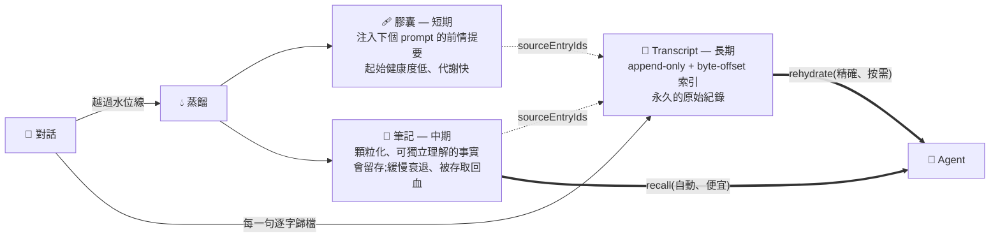
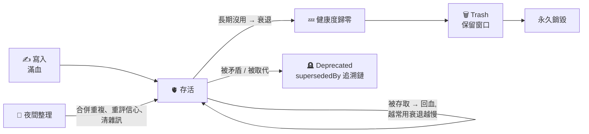
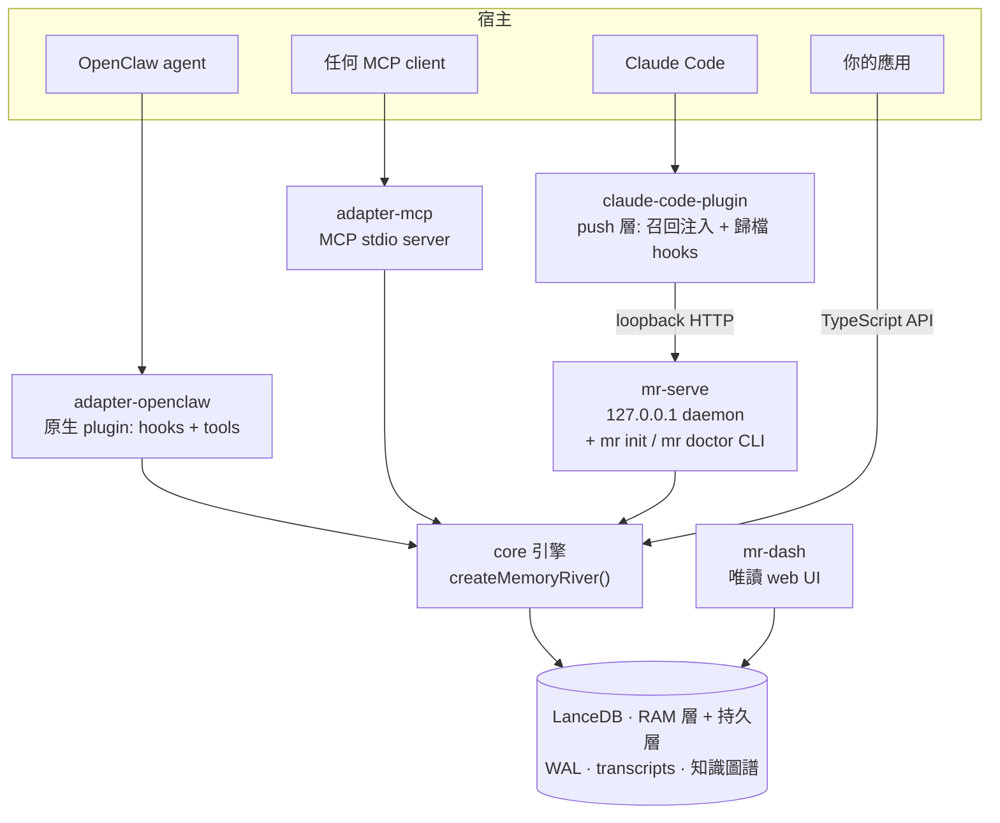

<div align="center">


<br>
<br>

**_給 AI agent 的長期記憶 —— 會褪色的工作摘要、會留存的事實、永遠能回頭重讀的完整原文。_**

<br>

[](LICENSE)
[](https://www.typescriptlang.org/)
[](https://nodejs.org/)
[](https://lancedb.com/)
[](https://ollama.com/)

<br>

[English](./README.md) · [core 套件文件](packages/core/README.zh-TW.md)

<br>

*大多數「agent 記憶」就是一個 vector store 加一顆儲存鍵 —— 一坨平的 embedding，往裡寫、往裡搜。*<br>
*Memory River 把記憶當成一套**系統**：跨三種時間尺度保存、兩段式檢索、隨時間代謝，*<br>
*而且任何被蒸餾出來的結論，都能**追溯回它來自哪幾句原文**。*

</div>

---

## ✨ 為什麼是 Memory River

大多數 AI 記憶系統的設計哲學是**資料庫**——存東西、查東西。Memory River 的設計哲學接近**記憶本身**：

| 一般「向量記憶」 | Memory River |
|:---|:---|
| 一坨扁平 embedding，存了就不動 | **三種時間尺度**：會褪色的膠囊、會留存的筆記、永久的原文 |
| 壓縮長對話 = 直接截掉舊內容 | 壓縮 = **蒸餾**成摘要 + 顆粒化筆記，原文逐字歸檔不丟 |
| 失真就失真，細節找不回 | 失真記憶帶**回指原文的指標**，agent 可 `rehydrate` 撈回逐字數字/人名/日期 |
| 記憶永遠不變 | 記憶會**衰退、被存取回血、被更新取代**；矛盾被標記 deprecated 而非默默並存 |
| 累積越來越髒 | **夜間整理**週期性去重合併；歸零記憶走 trash 保護路徑清掉 |
| Embedding 要雲端 API | **全本地** Ollama embedding，零雲端依賴、可自架 |
| 黑箱：為什麼撈到這條? | **可稽核**：每條蒸餾結論都能追回產生它的原文 |

> 這份 README 只描述 code 裡真的有的東西，不寫「願景」。

---

## 🧠 核心理念：三種時間尺度的記憶

當對話長過水位線，Memory River 不是把舊對話截掉，而是**蒸餾**成三層：



- **短期 — session 膠囊**：剛剛發生什麼的精簡前情提要，注入下一個 prompt 頂端。起始健康度低、**代謝快** —— 是*這次對話*的工作記憶，不是事實庫。膠囊依領域自適應(寫程式給結構化任務摘要、閒聊給自然語言前情提要)。
- **中期 — 蒸餾筆記**：每顆膠囊旁抽出幾條顆粒化、可獨立理解的事實，寫進記憶庫。起始滿血、**會留存** —— 幾天後 `recall` 撈到的就是這些。
- **長期 — 原始 transcript**：每一句逐字歸檔，帶 byte-offset 索引；膠囊記下它摘要了哪幾句原文 —— **所以壓縮不會真的丟失任何東西**。

---

## 🔍 兩段式檢索 + 主動補完(gap-aware rehydrate)

向量檢索**必然會損失精度**。Memory River 的答案不是「把所有細節硬塞進向量」，而是讓 agent **知道自己手上的不夠精確，主動回去撈原文**：

1. **粗召回(自動、便宜)**：每個回合前 `assembleContext` 注入最相關的少數記憶。永遠開著。
2. **Rehydrate(精確、按需)**：失真記憶帶著回指原文的指標 —— agent 用 **entry-id / 時間窗 / 關鍵字**撈回確切原文。

關鍵在 agent 的**判斷力**:把召回當「候選證據」不是答案，判斷夠不夠精確；不夠就走最可靠的 `entry_ids` 直達原文，召回落空才改用問題裡的具體實體做關鍵字搜尋；**撈到東西 ≠ 成功**(要驗原文真含答案)，跨策略升級後才說「不知道」。這套 disposition 是 agent-agnostic 的，可直接貼進任何 host agent —— 見 [`docs/AGENT_MEMORY_SYSTEM_PROMPT.md`](docs/AGENT_MEMORY_SYSTEM_PROMPT.md)。

> 常態很便宜(不必每回合重載整段對話)，精確細節永遠只差一跳，而且整條鏈**可稽核**。

---

## 🧬 會代謝的記憶

記憶不是寫一次就不動的列，它們**會活**。健康度走遺忘曲線:被命中就**回血**、長期沒用就**衰退**、存取越頻繁衰退越慢:



新事實**取代**相近舊事實；矛盾被**標記 deprecated**，絕不默默並存；夜間有一趟把冗餘記憶**合併**；歸零記憶走 trash 保護路徑清掉。核心類別(identity/constraint/business/core_rule)、高重要性事實、技能膠囊**免於衰減** —— 記憶庫保持相關，而不是長成一堆雜訊。

---

## 🗺️ 架構

一個引擎、多個入口。核心框架中立,每個宿主都經 adapter 接進來:



| 套件 | 是什麼 |
|:---|:---|
| [`@memory-river/core`](packages/core/README.zh-TW.md) | 框架中立的引擎與 `createMemoryRiver` API:儲存、蒸餾管線、檢索、transcript 歸檔、生命週期、圖譜/因果、技能、GWM |
| `@memory-river/service` | `mr-serve`,loopback-only HTTP daemon(`/recall`、`/store`、`/rehydrate`、`/archive-transcript`、`/health`)+ `mr init` / `mr doctor` onboarding CLI |
| `@memory-river/claude-code-plugin` | Claude Code 的 **push 層**:一支 hook 把相關記憶注入每個 prompt、另一支在 session 結束時歸檔 transcript —— fail-open、編輯器端零設定 |
| `@memory-river/adapter-openclaw` | 原生 OpenClaw plugin(hooks、tools、壓縮整合、session 歸檔) |
| `@memory-river/adapter-mcp` | MCP stdio server,把記憶/transcript/技能/工作記憶工具開給任何 MCP 宿主 |
| `@memory-river/dashboard` | `mr-dash`,唯讀 LanceDB 檢視器:CLI 報表 + 本機 web UI(memories / graph / slots / effectiveness) |
| `@memory-river/example-cli` | ~110 行、Ollama 驅動的獨立整合範例,證明 core 可脫離任何宿主使用 |
| `@memory-river/benchmark` | `mr-bench`:lifecycle、retrieval、CRAG、recovery、LoCoMo、中文對話評測 harness —— 下面的數字就是它跑的 |

---

## 🚀 Quick Start

**前置需求:** Node 22+,以及本機跑著 [Ollama](https://ollama.com/) 做 embedding(全本地,不需要任何雲端帳號):

```bash
ollama pull hf.co/Qwen/Qwen3-Embedding-0.6B-GGUF
```

### 路徑 A — 接進 Claude Code(最快有感)

```bash
# 0) 裝服務套件 —— 提供 `mr` 和 `mr-serve` 指令
npm install -g @memory-river/service

# 1) 設定 —— 三題精靈(--yes 全用預設),然後檢查環境
mr init
mr doctor

# 2) 起 daemon,讓它一直跑著
mr-serve

# 3) 接進 Claude Code
claude plugin marketplace add Hsi431/memory-river
claude plugin install memory-river@memory-river
```

從此你打的每個 prompt 都會被注入相關的長期記憶,session 結束時 transcript 自動歸檔。hooks 是 **fail-open**:daemon 沒起就靜默跳過,絕不弄壞 Claude Code。

`mr init` 只問三件事:embedding 供應商(半永久 —— 之後換要重建全部索引)、蒸餾 LLM(或 `skip` 進[無 key 降級模式](#%EF%B8%8F-耐久性語意--營運誠實))、data 目錄。設定寫進 `~/.memory-river/config.json`(mode `0600`)。`mr doctor` 接著逐項檢查七件事 —— config、embedding 可達性+維度、LLM key、`/dev/shm` 空間、服務 port、data 目錄可寫、WAL 狀態 —— 每項附一行修法提示。

### 路徑 B — 完全獨立,不接任何宿主

demo CLI 在 repo 裡(沒有發上 npm):

```bash
git clone https://github.com/Hsi431/memory-river && cd memory-river
npm ci && npm run build
ollama pull qwen3:8b   # demo 用的本地小聊天模型

npx mr-demo remember "老闆喜歡手沖咖啡"
npx mr-demo recall "咖啡"
npx mr-demo chat
```

程式內嵌用法、完整 API、依賴 ports 與移植指南，見 **[core 套件文件](packages/core/README.zh-TW.md)**。

### 🔭 看見記憶：Web Dashboard

記憶不該是黑盒。`mr-dash serve` 起一個**唯讀**的本機 web 界面(綁 `127.0.0.1`，不外連、不改任何資料），用瀏覽器就能看一個 memory-river 實例的內部狀態：

```bash
# 讓這個終端保持開著，再用瀏覽器開印出的網址
node packages/dashboard/dist/cli.js serve --db /path/to/lancedb --port 7777
# → http://127.0.0.1:7777
```

分頁籤涵蓋 **Tables**（各表行數）、**Effectiveness**（子系統效能）、**Night**（夜間整併統計），以及直接瀏覽記憶內容的 **Memories / Graph / Slots**（含 capsule 健康度、知識圖譜三元組、結構化參數）。內建中文/EN 切換與明暗主題。

### 開發

```bash
npm ci
npm run build
npm test -ws
bash scripts/ci-local.sh   # CI 跑的東西:模擬乾淨檢出 → build → typecheck → 全部測試
```

---

## 📊 成績 — LoCoMo 全量

公開的 **LoCoMo** 是長對話記憶的標準 benchmark。我們用自己想看到的方式報:**全量 1,986 題**(非抽樣)、**單一次 run**、**經真的答題 agent 端到端**評分(不是只報檢索召回、也沒為 benchmark 調過答題 prompt)。headline 涵蓋 cat 1–4(1,539 題);cat 5(447 題)獨立列在下方。

| 類別 | 我們的 judge(不給部分分) | mem0 式 LLM-judge rubric |
|:---|---:|---:|
| 1 · 多跳 / 列舉 | 34.8% | 84.8% |
| 2 · 時序推理 | 66.4% | 76.6% |
| 3 · 開放推論 | 45.8% | 57.3% |
| 4 · 單跳 | 68.7% | 82.1% |
| **整體(cat 1–4)** | **60.6%** | **79.9%** |

*cat5 是對抗類別 —— 「標準答案」是誘答,正解為拒答/糾正,故比照 mem0 的協定不併入 headline,獨立列為穩健性軸(全量 run 拒答準確率 70.4%)。*

### 評測協定(Benchmark protocol)

LoCoMo 分數對評測協定極度敏感。公開數字常常把好幾個變因混在一起:記憶系統本身、答題模型、答題 prompt、judge rubric、context 預算,以及系統是否被允許跑多步檢索迴圈。

**Memory River 先報保守的分數。** 我們的主分數用:

- 全量 LoCoMo,不是抽樣子集
- 一套固定的通用答題 prompt
- 一個 flash 級答題模型
- 不做類別路由
- 不為 LoCoMo 調答題 prompt
- 不偷看 oracle 證據
- 沒有藏在背後的 benchmark 專用 retry 迴圈
- 經真實 agent loop 端到端答題

這刻意比常見的排行榜式設定更嚴。它量的是 Memory River 作為「嵌進真實 agent 的通用記憶引擎」,不是一條為 benchmark 特化的答題流水線。

為了對照,我們在**完全相同的那批生成答案**上,另外報一個 mem0 式的 LLM-as-judge 分數。這不動 agent、不動檢索到的 context、不動模型輸出 —— 只換 judge rubric。這個對照重要,是因為光是 rubric 就能把分數拉動很大:在我們這次 run,同一批 cat1 答案在嚴格的不給部分分 judge 下是 **34.8%**,在 mem0 式 rubric 下變 **84.8%**。這就是為什麼 LoCoMo 數字不附完整評測協定就不該被拿來比。

在 mem0 式 rubric 下,Memory River 的 cat1–4 達 **79.9%**(rubric prompt 從 `mem0ai/memory-benchmarks` 逐字複製)。judge parse failure 一律算錯(17/1,539),因此 79.9% 不是把失敗樣本排除後的美化數字。我們把它當「跟公開數字可對照」的比較值,不是主要的工程分數 —— 主數字仍是那個較嚴的端到端分數。

重點不是表演排行榜的把戲,而是把取捨攤開來看:

- **嚴格分數** —— agent 真正答對了什麼
- **mem0 式分數** —— 同一批答案在常見公開 rubric 下長什麼樣
- **架構** —— 框架中立、可自架的記憶引擎,不是託管檢索服務、也不是為 benchmark 特化的 agent 堆疊

這也是為什麼這張表不能只看分數,還要看系統被允許做什麼。

---

## 🛡️ 耐久性語意 & 營運誠實

真的保證什麼、不保證什麼 —— 要放進不能丟的資料前先讀這段:

- **WAL,at-least-once。** `update` / `delete` / `batch_update` 先寫 write-ahead log 才 commit。當機後恢復是**冪等 roll-forward**:已回覆成功的操作一定還在;還在飛行中的操作 —— **包括一筆從未回覆成功的 delete** —— 也可能被套用。語意是設計上的 at-least-once,不宣稱 exactly-once。
- **當機一致的寫入。** 一筆寫入要嘛完整落地、要嘛完全沒有 —— 寫到一半殺掉行程(用 `SIGKILL` 實測)不會留下半列資料。
- **雙層,單一 source of truth。** 持久層(`dataDir`)是 source of truth;RAM 層是快的工作副本。`storageMode: auto | ram | ssd` —— `auto` 啟動時量 `/dev/shm` 剩餘空間,裝不下就降級成 SSD 上的單一持久表(原因寫進 log;可用 `storageMode: ram` 強制)。**備份 `dataDir`** 就夠,其他都不用。
- **Transcript 保存有上限。** transcript 檔 5 MB 一輪替,每個 session 保留**最近 10 代**,更舊的刪除。rehydrate 會透明地跨代讀,但逐字歷史是有限的 —— 「長期」是長,不是無限。
- **單機、單 daemon。** 一個 data 目錄同時只允許一個活行程,由檔案級 takeover 鎖強制(死行程留下的鎖會被安全接管;兩個活行程不支援)。沒有 replication、沒有分散式模式。
- **沒有 LLM key?降級,不是壞掉。** 沒有任何 LLM key 時蒸餾會跳過(明確寫 log)—— transcript 歸檔與 recall 照常運作。你只少了自動膠囊/筆記抽取,其他都在。

---

## 🔒 安全

- **只綁 loopback。** `mr-serve` 只綁 `127.0.0.1`、沒有身分驗證 —— 給信任的本機 client 用。不要把它 reverse-proxy 到網路上。
- **預設全本地。** embedding 在你機器上跑(Ollama);記憶內容只有在你*選擇*雲端蒸餾 LLM 時才會離開機器(那些文字會送到該供應商 —— 不能接受就在 `mr init` 選 `skip`)。
- **輸入驗證。** session key 先驗證才拿去組檔案路徑;onboarding config 以 mode `0600` 寫入。
- **LLM 輸出驗證。** 夜間整併的 LLM 決策逐欄 runtime 檢查(action、目標 id、信心值範圍);格式不合的一律跳過並記 log,絕不套用。
- **唯讀檢視。** dashboard 永不改資料、只綁 loopback。

---

## 🏗️ 怎麼蓋起來的

| 子系統 | 做什麼 | 模組 |
|:---|:---|:---|
| 雙層儲存 + WAL | RAM 目錄(可放 tmpfs)熱讀、資料目錄持久層、write-ahead log 含當機恢復 | `store/store-v4` |
| 蒸餾管線 | 舊對話摘成膠囊 + 顆粒化筆記,經非同步 inbox 寫入 —— **寫入永不阻塞對話** | `distill/concentrator-adapter` + `pipeline/inbox-watcher` |
| Transcript + rehydrate | 逐字原文歸檔 + byte-offset `.idx`;用 entry-id / 時間 / 關鍵字撈回原文 | `transcript/` |
| Hybrid 檢索 | 向量 + 全文 BM25、RRF 融合、可選本地 rerank(CRAG 式 accept/partial/reject,調在 recall 安全端)、EntitySynergyMerger(NER 碎片搶救)、Structured Slot 去重、因果鏈上下文擴展 | `retrieval/retriever-v4` |
| 知識圖譜 | 三元組(subject–relation–object)儲存,向量 + FTS 實體搜尋,供鉤子做語意查詢擴展 | `store/graph-store` |
| 記憶代謝 | 健康度衰減 / 存取回血 / 歸零走 trash | `lifecycle/cleanup-engine` |
| 夜間整理 | 週期性離線合併、壓縮相關記憶 | `lifecycle/night-consolidation` |
| 聯想鉤子 | 記憶可帶觸發關鍵字,命中時連帶喚起相關記憶;命中成效有回饋閉環動態調權 | `cognition/hooks-engine` |
| 因果 + 衝突 | 新事實取代相近舊事實;矛盾標記 deprecated 並記 `supersededBy` 追溯鏈 | `cognition/causal-engine` + `conflict-detector` |
| Structured Slot | 寫入時抽結構化參數(slotKey/slotValue)+ 版本鏈;檢索時同 slot 只回最新 active | `pipeline/inbox-watcher` + `retrieval/retriever-v4` |
| 全局工作記憶 (GWM) | 追蹤長對話主任務,embedding 漂移偵測,偏題時注入提醒拉回 | `cognition/global-working-memory` |
| 技能膠囊 v2 | 顯式儲存的程序性知識,漸進式揭露:平時只注入一行索引,要用才載入完整步驟 | `engine` + `skills/` |
| Ralph Loop | context 斷路器:連續失敗時修剪 / 截斷 context、注入警告,防 context 爆掉 | `cognition/ralph-core` |
| 可觀測性 | 每個子系統 best-effort 寫統計列,事後可稽核 | 遍布全系統 |

---

## 🔬 核心子系統(細說)

### 🏗️ 雙層儲存 + WAL — _寫入不丟、讀取不慢_
熱層放可寫的 RAM 目錄(Linux 上可指 tmpfs/`/dev/shm`,毫秒級讀寫),持久層落資料目錄。`update` / `delete` / `batch_update` 先寫 **write-ahead log** 再落盤,當機後可 replay;replay 冪等、失敗保留 log 供下次重試。LanceDB 寫入包 jittered 指數退避;SSD 連續失敗會優雅降級成 RAM-only 並稍後重試。**不**宣稱 exactly-once 或零資料遺失 —— 把資料目錄當應用程式狀態備份。`store/store-v4`

### 💧 Concentrator — _壓縮不是丟掉,是蒸餾_
對話長過**動態水位線**(依對話模式自適應:寫程式、一般、閒聊各有不同門檻;取樣時排除 tool 噪音),就把舊對話蒸餾成**雙軌**產物:一顆短期**膠囊**(注入下個 prompt 頂端的前情提要)+ 幾條**顆粒化筆記**(寫進記憶庫的耐久事實)。筆記抽取走原理化規則(只收耐久、可查詢、未來有用的事實,排除寒暄/meta/一次性),空膠囊(LLM 產出的自我指涉廢話)會被偵測降級。供應商選擇/重試/fallback 屬於**你注入的 `LlmClient`** —— core 刻意不內建多供應商鏈。`distill/concentrator-adapter`

### 📜 Transcript + Rehydrate — _壓縮的底層保險_
每一句逐字歸檔成 append-only JSONL,帶 byte-offset `.idx` sidecar(拿到 entryId 就 O(1) 定位),自動 rotation。膠囊/筆記記下它摘要了哪幾句原文(`sourceEntryIds`),所以失真記憶能被**還原**:`memory_rehydrate` 支援 entry-id(最精確)、時間窗、關鍵字(ranked-OR 匹配)三種模式。這是「lossy 記憶 + 主動補完」的底層(見上面 [兩段式檢索](#-兩段式檢索--主動補完gap-aware-rehydrate))。`transcript/`

### 🔍 Retriever — _多層篩選,只給最值得看的_
召回不是單純向量搜尋:**Hybrid**(向量 + 全文 BM25 + RRF 融合)→ **Hooks 聯想**(+ 知識圖譜語意擴展)→ **EntitySynergyMerger**(當多條記憶各含部分事實時,用 NER + IDF-weighted Jaccard 把碎片拼回,純本地零 LLM token)→ **CRAG 品質審核**(accept/partial/reject,門檻調在 recall 安全端,只擋明顯不相關、不誤殺近義)→ **Structured Slot 去重**(同 slot 只留最新)→ **因果鏈擴展**。`retrieval/retriever-v4`

### 📊 GraphStore — _知識圖譜三元組_
把記憶裡的關係抽成 `subject–relation–object` 三元組獨立儲存(例:`Alice –is– CEO –of– ArtiMart`),三元組文字自動向量化做 ANN 語意搜尋、subject 欄位做 FTS 實體搜尋。檢索時供 Hooks 做語意查詢擴展,把相關實體一起拉進來。`store/graph-store`

### 🧬 Causal Engine — _記憶是因果鏈,不是碎片_
新記憶寫入時判定它與既有記憶的關係:`UPDATE`(夠近 + 字面重疊 → 舊記憶標 deprecated、新記憶繼承 parentId)、`CAUSAL`(中等距離 → 建因果連結、兩筆共存)、`INDEPENDENT`(無關)。只做純函式判定,實際 update/deprecate 交給 inbox/StatusManager;門檻依 embedding 維度自動計算、同 category 自動放寬。`cognition/causal-engine`

### ⚡ Conflict Detector — _像大腦一樣主動遺忘_
模擬 retrieval-induced forgetting:只對高衝突類別(`preference`/`constraint`/`identity`/`decision`)觸發,寫入後掃同類相似記憶,LLM 判定語意衝突 → 衝突記憶標 deprecated 並記 `supersededBy` 追溯鏈。保守策略:判定失敗預設共存,不確定絕不刪。`cognition/conflict-detector`

### 🎯 Structured Slot — _精確參數不靠人記_
寫入時自動抽結構化參數(例:「SSH port 改成 2222」→ `slotKey=technical:ssh_port, slotValue=2222`),信心夠才寫入、不夠降級為自由文本。同 slotKey 有版本鏈,舊值標 deprecated、新值 active;檢索時同 slot 只回最新 active,不會新舊並陳。`pipeline/inbox-watcher` + `retrieval/retriever-v4`

### 🎣 Hooks Engine — _觸景生情的聯想網路_
不是關鍵字匹配,是 LLM 生成的**概念觸發器**(好鉤子:「報告撰寫規範」;爛鉤子:「報告」)。三級權重,有**品質回饋閉環**:鉤子觸發 → CRAG 審核結果回報 → 動態調權,長期低效的鉤子自動淘汰。`cognition/hooks-engine`

### 🌀 Global Working Memory (GWM) — _短期目標不漂移_
追蹤長對話的主任務目標,每輪用 embedding cosine 偵測主題漂移,偏題時注入提醒把 agent 拉回正軌;有注入控制防每輪重複、狀態持久化重啟可復原。工具面:`gwm_on/off/status/update`。`cognition/global-working-memory`

### 🫀 Health System — _記憶有生命週期_
基於遺忘曲線:被命中就**回血**、長期沒用就**衰退**;存取頻率越高衰退越慢。歸零的記憶走 trash 軟刪除、保留一段時間後永久銷毀。核心類別(identity/constraint/business/core_rule)與高重要性事實、技能膠囊**免於衰減**。衰退走 batch + 單筆 WAL,之後自動 `optimize()` 回復讀效。`lifecycle/cleanup-engine`

### 🌙 Night Consolidation — _AI 的睡眠整理_
週期性離線整理:掃描記憶,由 LLM 判定每段該 `keep`/`merge`/`delete`/`update`,合併更新走 batch 單筆 WAL commit,且每個 LLM 決策**套用前都經 runtime 驗證**。精準重排程避免 timer drift。`lifecycle/night-consolidation`

### 🧹 Cleanup Engine — _時間驅動的垃圾回收_
以**時間驅動為主**(每日排程 + 啟動時若距上次過久就補跑 startup recovery),session_end 為輔 —— 長對話不會發 session_end 的場景仍正確。負責 decay sweep、軟刪除、trash 過期清理。`lifecycle/cleanup-engine`

### 💊 Skill Capsule v2 — _顯式儲存的可復用程序_
技能是 agent **顯式儲存**的程序(系統不自動生成):漸進式揭露 —— 平時只注入一行索引(零 token 成本),agent 呼叫 `skill_load` 才載入完整步驟。誠實使用統計(只有 load 才 +1 usage)、確定性品質閘(格式不合一次列完、不用 LLM 評審)、衰退速度是一般記憶的 1/4。`engine` + `skills/`

### 🛡️ Ralph Loop — _context 斷路器_
連續失敗時:先修剪尾部錯誤訊息重試 → 再注入結構化警告、縮減 context → 仍失敗則物理截斷 context、回安全回應;成功自動重置。防止 context 在錯誤循環裡爆掉。`cognition/ralph-core`

---

## 🎯 定位

- **中文優先**:濃縮、檢索(jieba 斷詞 FTS)、rehydrate 都針對中文打磨 —— 多數記憶層英文優先、中文品質差，這是我們刻意守的位。英文是地板(不退)，不是靶。
- **可自架 / 隱私**:embedding 全本地(Ollama)、儲存本地(LanceDB)，不必把記憶交給第三方雲端。
- **框架中立**:核心引擎不綁宿主，`createMemoryRiver` 注入你自己的 embedding 與 LLM;附 OpenClaw adapter、MCP server、Claude Code plugin,以及 ~110 行的 example-cli 證明可獨立整合。
- **誠實**:不宣稱 exactly-once / 零資料遺失;能力以 code 為準。

---

## 🧭 現況 & 路線圖

**現況:** 每天在真實環境 dogfood —— Memory River 是作者自己 agent 群的現役記憶層,同時以 OpenClaw plugin 與 Claude Code push 層兩種形態跑在日常真對話上。每個改動都過 CI(Node 22/24):乾淨檢出 build、全 workspace typecheck、完整測試。1.0 前 API 仍可能變動。

**路線圖:**

- 真正的低記憶體單表模式(現在的 SSD fallback 保行為、不保雙層的速度)
- 按類別的答題模型路由,給願意用成本換準確率的宿主
- 更多宿主 adapter 與更豐富的 push 層整合
- 由外部 code review 驅動的持續加固

---

## 📄 授權

**Apache-2.0** © 2026 Hsi431。

自由使用、修改、嵌進你的 agent、自架、商用出貨都可以 —— 寬鬆的 Apache 2.0 條款。詳見 [LICENSE](LICENSE)。

<div align="center">
<br>

🌊 *記住，不是存起來;是活著。*

</div>
